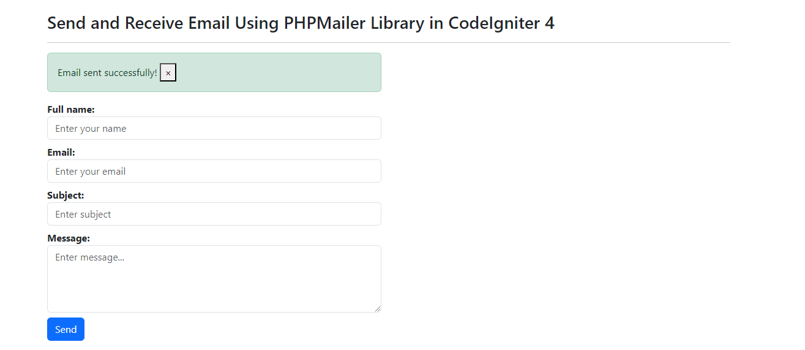

# Send Responsive HTML Email Using PHPMailer Library in CodeIgniter 4


## Intro
Learn how to send beautifully designed HTML responsive emails in CodeIgniter 4 using the PHPMailer library. This tutorial covers the step-by-step process of setting up PHPMailer, integrating it with your CodeIgniter 4 project, and customizing email templates to create professional, mobile-friendly emails. Perfect for developers looking to enhance their email functionality in web applications.

## What is CodeIgniter?

CodeIgniter is a PHP full-stack web framework that is light, fast, flexible and secure.
More information can be found at the [official site](https://codeigniter.com).

This repository holds a composer-installable app starter.
It has been built from the
[development repository](https://github.com/codeigniter4/CodeIgniter4).

More information about the plans for version 4 can be found in [CodeIgniter 4](https://forum.codeigniter.com/forumdisplay.php?fid=28) on the forums.

You can read the [user guide](https://codeigniter.com/user_guide/)
corresponding to the latest version of the framework.

## Installation

To install CodeIgniter 4 using Composer command. Open your terminal or command prompt and run the following composer command:
```bash
composer create-project codeigniter4/appstarter projectFolderName
```

In this project, we will need PHPMailer Library, that is why you will install that package via this composer command:
```bash
composer require phpmailer/phpmailer
```

## Setup

Copy `env` to `.env` and find `CI_ENVIRONMENT` variable and set value from production to development.


## Routes

```php
$routes->get('/', 'Home::index');
$routes->get('/contact', 'EmailController::index',['as'=>'index']);
$routes->post('/contact', 'EmailController::sendEmail',['as'=>'send']);
```

## Controller
Create a controller using `php spark make:controller Email --suffix` command and add the following code into it:

```php
<?php

namespace App\Controllers;

use App\Controllers\BaseController;
use CodeIgniter\HTTP\ResponseInterface;

use PHPMailer\PHPMailer\PHPMailer;
use PHPMailer\PHPMailer\Exception;

class EmailController extends BaseController
{
    protected $helpers = ['form']; // Remember to add this helper

    public function index()
    {
        return view('index');
    }

    public function sendEmail()
    {
        
        $request = \Config\Services::request();

        /** Validate the form */
        $isValid = $this->validate([

            'name' => [
                'rules' => 'required',
                'errors' => [
                    'required' => 'Email is required',
                ]
            ],
            'email' => [
                'rules' => 'required|valid_email',
                'errors' => [
                    'required' => 'Email is required',
                    'valid_email' => 'Please check email field. It does not appears to be valid.'
                ],
            ],

            'subject' => [
                'rules' => 'required',
                'errors' => [
                    'required' => 'Subject field is required'
                ]
            ],

            'message' => [
                'rules' => 'required|min_length[10]',
                'errors' => [
                    'required' => 'Password is required',
                    'min_length' => 'Password must have atleast 10 characters in length.'
                ]
            ]

        ]);

        if (!$isValid) {
            /** If validation errors founded, display errors under each input field */
            return view('index', ['validation' => $this->validator]);
        } else {

            

            /** Prepare HTML email  */
            $email_data = [
                'name'=>$request->getVar('name'),
                'email'=>$request->getVar('email'),
                'subject'=>$request->getVar('subject'),
                'message'=>$request->getVar('message'),
            ];
            $view = \Config\Services::renderer();
            $mail_body = $view->setVar('email_data', $email_data)->render('email-template');

            $mail = new PHPMailer(true);

            try {
                $mail->SMTPDebug = 0;
                $mail->isSMTP();
                $mail->Host = 'sandbox.smtp.mailtrap.io';
                $mail->SMTPAuth = true;
                $mail->Username = 'dccfc7889edc52';
                $mail->Password = '3f631eb3bed9a9';
                $mail->SMTPSecure = 'TLS';
                $mail->Port = 587;
                $mail->setFrom($request->getVar('email'), $request->getVar('name'));
                $mail->addAddress('sendto@gmail.com', 'SendToName');
                $mail->isHTML(true);
                $mail->Subject = $request->getVar('subject');
                $mail->Body = $mail_body;

                if( $mail->send() ){

                    return redirect()->route('index')->with('success','Email sent successfully!');

                }else{
                    return redirect()->route('index')->with('fail','Email not sent, Something went wrong.!');
                }


            } catch (Exception $e) {
                return redirect()->route('index')->with('fail','Message could not be sent. Mailer Error: '.$mail->ErrorInfo);
            }
        }
    }
}


```

## Form Page

Create `App\Views\index.php` view file and add the following markup:

```html
<!DOCTYPE html>
<html lang="en">

<head>
    <meta charset="UTF-8">
    <meta name="viewport" content="width=device-width, initial-scale=1.0">
    <title>Send Responsive HTML Email Using PHPMailer Library in CodeIgniter 4</title>
    <link rel="stylesheet" href="bootstrap-5.3.3-dist/css/bootstrap.min.css">
</head>

<body>


    <div class="container">

        <h3 class="mt-4">Send Responsive HTML Email Using PHPMailer Library in CodeIgniter 4</h3>
        <hr>
        <div class="row">
            <form action="<?= base_url('/contact') ?>" method="post" class="col-md-6">

                <?= csrf_field() ?>

                <?php $validation = \Config\Services::validation(); ?>

                <?php if (!empty(session()->getFlashdata('success'))) : ?>
                    <div class="alert alert-success">
                        <?= session()->getFlashdata('success') ?>
                        <button type="button" class="close" data-dismiss="alert" aria-label="Close">
                            <span aria-hidden="true">&times;</span>
                        </button>
                    </div>
                <?php endif; ?>
                <?php if (!empty(session()->getFlashdata('fail'))) : ?>
                    <div class="alert alert-danger">
                        <?= session()->getFlashdata('fail') ?>
                        <button type="button" class="close" data-dismiss="alert" aria-label="Close">
                            <span aria-hidden="true">&times;</span>
                        </button>
                    </div>
                <?php endif; ?>

                <div class="form-group mb-2">
                    <label><b>Full name:</b></label>
                    <input class="form-control" type="text" name="name" placeholder="Enter your name" value="<?= set_value('name') ?>">
                    <?php if ($validation->getError('name')): ?>
                        <div class="d-block text-danger">
                            <?= $validation->getError('name') ?>
                        </div>
                    <?php endif; ?>
                </div>
                <div class="form-group mb-2">
                    <label><b>Email:</b></label>
                    <input class="form-control" type="text" name="email" placeholder="Enter your email" value="<?= set_value('email') ?>">
                    <?php if ($validation->getError('email')): ?>
                        <div class="d-block text-danger">
                            <?= $validation->getError('email') ?>
                        </div>
                    <?php endif; ?>
                </div>
                <div class="form-group mb-2">
                    <label><b>Subject:</b></label>
                    <input class="form-control" type="text" name="subject" placeholder="Enter subject" value="<?= set_value('subject') ?>">
                    <?php if ($validation->getError('subject')): ?>
                        <div class="d-block text-danger">
                            <?= $validation->getError('subject') ?>
                        </div>
                    <?php endif; ?>
                </div>
                <div class="form-group mb-2">
                    <label><b>Message:</b></label>
                    <textarea class="form-control" rows="4" name="message" placeholder="Enter message..."><?= set_value('message') ?></textarea>
                    <?php if ($validation->getError('message')): ?>
                        <div class="d-block text-danger">
                            <?= $validation->getError('message') ?>
                        </div>
                    <?php endif; ?>
                </div>
                <div class="form-group mt-2">
                    <button class="btn btn-md btn-primary" type="submit">Send</button>
                </div>

            </form>
        </div>
    </div>

</body>

</html>
```


## Email template view
Create `App\Views\email-template.php` view file and add the following markup:

```html
<!DOCTYPE html>
<html lang="en">
<head>
    <meta charset="UTF-8">
    <meta name="viewport" content="width=device-width, initial-scale=1.0">
    <title></title>
    <style>
        body {
            font-family: Arial, sans-serif;
            margin: 0;
            padding: 0;
            background-color: #f4f4f4;
        }
        .email-container {
            max-width: 600px;
            margin: 0 auto;
            background-color: #ffffff;
            padding: 20px;
            border-radius: 8px;
        }
        .header {
            text-align: center;
            padding: 10px 0;
            background-color: #007BFF;
            color: #ffffff;
            border-radius: 8px 8px 0 0;
        }
        .content {
            padding: 20px;
            color: #333333;
            line-height: 1.6;
        }
        .footer {
            text-align: center;
            padding: 10px;
            font-size: 12px;
            color: #999999;
        }
        @media screen and (max-width: 600px) {
            .email-container {
                padding: 10px;
            }
            .content {
                padding: 10px;
            }
        }
    </style>
</head>
<body>
    <div class="email-container">
        <div class="header">
            <h1><?= $email_data['subject']; ?></h1>
        </div>
        <div class="content">
            <p>Hello Dear,</p>
            <p><?= $email_data['message']; ?></p>
            <p>Best regards,<br><?= $email_data['name']; ?></p>
        </div>
        <div class="footer">
            <p>&copy; <?= date('Y'); ?> Your Company Name. All rights reserved.</p>
        </div>
    </div>
</body>
</html>

```

## Hint

When you go live (Cpanel), you will need to change these variables according to the mail configuration for Cpanel email address.

```php
$mail->Host = 'mail.yourdomail.com';
$mail->Username = 'yourname@yourdomail.com'; //Your full email addresss
$mail->Password = 'Password@'; //Password you set up for the email address
$mail->SMTPSecure = 'TLS'; // or SSL
$mail->Port = 587; // 465 or 587 (SSL/TLS)
$mail->setFrom($request->getVar('email'), $request->getVar('name'));
$mail->addAddress('sendto@gmail.com', 'SendToName');

```

## Important videos

> Watch the following videos to get more information
> - [Get Mailtrap.io Configurations](https://youtu.be/kC4v8g5C59M?list=PLX4adOBVJXavmNeP7CU295sX76jgzziio&t=618)
> - [Create Cpanel email account](https://youtu.be/2GFiORMPaAw?list=PLX4adOBVJXavmNeP7CU295sX76jgzziio&t=103)


